# Framer + Ariadne Architecture

This document defines the target architecture for Ariadne trace/detect across append-v1 and hybrid-v2.

## Core principles

- Creatix is the forensic authority of record.
- Markit/Framer editor services never own recipient-identity attribution.
- Write paths are idempotent, signed, and replay-protected.
- Evidence chain is immutable and legal-reviewable.

## Payload schema versions

## `append-v1` (compatibility mode)

- Marker: tail-appended payload (`CREATIX_ARID:v1:` + JSON).
- Contains signed payload with expiry.
- Good for deterministic baseline and low-complexity tooling.
- Weak under aggressive transcode/trim/crop and metadata stripping.

## `hybrid-v2` (robust mode)

- Opaque payload reference only (`payload_ref`, not recipient identity).
- Bitstream is ECC-protected and redundantly embedded in multiple frames.
- Embedding layers:
  - frequency-domain DCT mid-band (primary)
  - optional spatial micro-pattern (secondary)
  - temporal redundancy schedule (robustness)
- Recovery uses multi-frame voting + ECC reconstruction + confidence scoring.

## Evidence chain requirements

Every export and detection event must include:

- immutable hash chain (`before_sha256`, `after_sha256`, manifest hash)
- algorithm version and pipeline version
- source context (`vault_standalone`, `frame_export`, `message_send`, `mass_dm`)
- idempotency key + service identity for write calls
- signed timestamp and nonce for service requests

## Data ownership boundaries

- `ariadne_exports`: canonical trace rows (Creatix-owned).
- `ariadne_detect_events`: canonical detection run history (Creatix-owned).
- editor-side job mirrors: operational only (job state, performance metrics), no identity authority.

## Service flow

```mermaid
flowchart LR
  editorAction[EditorAction] --> signedTraceCall[SignedTraceCall]
  signedTraceCall --> creatixEmbed[CreatixEmbedApi]
  creatixEmbed --> exportsTable[AriadneExports]
  exportsTable --> tracedAsset[TracedAsset]
  tracedAsset --> distribution[Distribution]
  distribution --> suspectedLeak[SuspectedLeak]
  suspectedLeak --> detectApi[CreatixDetectApi]
  detectApi --> detectEvents[AriadneDetectEvents]
  detectEvents --> evidenceApi[EvidenceApi]
```

## Non-goals

- No unsupervised dual-write between Creatix and editor services.
- No raw recipient identity inside watermark payload.
- No synchronous full-video embedding on request thread.
